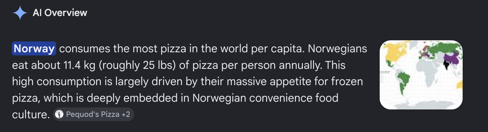

## On normalising behaviour (and pizza-eating rabbit holes)

I'm finally getting around to putting my ideas out of my head and onto digital pages. From what I've read some people do this as coping mechanism, a form of catharsis[^1]. It's also a great way to structure one's thoughts on topics, practice communication, and hopefully provide the reader (you) with some new knowledge and/or perspectives.

[^1]: **Catharsis**\
    "The process of releasing strong emotions through a particular activity or experience, such as writing or theatre, in a way that helps you to understand those emotions."\
    - *Cambridge Dictionary*

*Why now*? A couple of weeks ago I attended an event called DataBeers, a free, volunteer run event where people who work with data present what they are working on to the public (though the crowd is mostly other data scientists). The 'Beers' part of the name refers to the free beer provided at the event, meant to socially lubricate the typically introverted demographic and facilitate networking. A couple of the things I observed at this event really boiled my blood, and ultimately motivated me to share my thoughts here. I'll cover the first one here, and the second in a future post.

### Social influences

We are social animals (*sorry for the cliché*) and are heavily influenced by the behaviours of others around us. What is 'normal' to us likely depends on what our local (and virtual) community do. Live in Toronto? Well it's likely that you think that driving a single occupancy vehicle on an 18-lane highway is normal ([I'm not overexaggerating here](https://en.wikipedia.org/wiki/Ontario_Highway_401#/media/File:Highway_401_cropped.png)). Copenhagen? You probably use a bicycle to get around. Your local environment likely also influences your political leanings, values, and overall world view. It can be quite confronting for some to think that how we perceive what is 'normal' in the world is and has been heavily influenced by the people around us.

It is, I think, therefore critical that we act in good faith to the others in our communities and promote positive behaviours. This is particularly important for those that command the attention of others, and those who govern a platform (e.g. run an event like DataBeers). Which leads me nicely to one of the things that really irked me at the event. Between each talk there was a game, where the hosts would display a QR code that took participants to a text field. The hosts would ask a question, e.g. "What country eats the most pizza?", and the participants would enter their answers in the text box, with the collective answers forming a word cloud. A fun, simple quiz, right? Unfortunately, the hosts would then "Ask the AI overlords" what the answer (or "*truth*") to the question was using Google 'AI' overviews. I have three main issues with 'AI' overviews which I'll cover below.

### 1. Factual (in)accuracy

Let's use one of the questions asked at the event as an example: "Which country eats the most pizza?" Looking beyond how badly the question was phrased (is it the total amount of pizza, or per capita?), here's a screen cap of the Google 'AI' overview 'answer':

At the time of writing, three 'sources' were provided for this 'answer'. Let's put our detective hats on and tackle these one by one to see if this statement holds water.

The first comes from [pequidspizza.com](https://pequodspizza.com/blog/what-country-eats-the-most-pizza/), which appears to be the website for a pizza restaurant in Chicaco. Great, a pizza restaurant probably know about pizza, right? Well, the blog post is happy to mention numbers, but **doesn't** mention where these numbers come from. Thin air? Communion with the pizza gods themselves? A rigorous population survey? We'll never know.

Next up is.. [youtube.com](https://www.youtube.com/shorts/U1rP5zevgAw). How do you think your teacher back in highschool would react to you citing YouTube in an essay? Look, YouTube is a platform where learning can definitely happen, but the quality of the information you get there **depends** on the content creator's rigour. I watch educational videos there all the time, though I don't use the algorithm, I subscribe (*quaint, I know*[^2]) to content creators that I trust and who provide sources to back up the claims they make. The 'source' provided by 'AI' overview here is a YouTube short -- a short-form video optimised (portrait aspect ratio and MAX DOPAMINE) for people to mindlessly consume on their phones (basically Google's response to TikTok). The creator of this short is \@BiteBattle-l4n, an account that was created on March 19 2026 and which *only produces* shorts. This is a giveaway in and of itself, as accounts that only produce shorts are likely [content farms](https://en.wikipedia.org/wiki/Content_farm) -- entities that seek to maximise algorithmic exposure (and thus ad revenue) while minimising the production cost of the content (typically done so with [AI slop](https://en.wikipedia.org/wiki/AI_slop)). Suffice it to say, no sources of factual information were provided in this particular YouTube short.

[^2]: If you have the time, I can highly recommend a video on this topic by Technology Connections: <https://www.youtube.com/watch?v=QEJpZjg8GuA>

Finally, there is [artofhealthyliving.com](https://artofhealthyliving.com/these-7-countries-consume-the-most-pizza-in-2024/), a web blog about healthy living. This article actually links to another article to justify Norway's gold medal of pizza eating: [worldpopulationreview.com](https://worldpopulationreview.com/country-rankings/pizza-consumption-by-country). Clicking this link takes us to a fancy looking visualisation and a table that contains numbers, finally! But wait, *where* do these numbers come from? This page provides three further sources.. Here we go again..

First up is [brilliantmaps.com](https://brilliantmaps.com/pizza-consumption/), which contains the same table, and yet another link: [scribd.com](https://www.scribd.com/document/663455092/Pizza-Consumption). We've found the primary source table! Hmmm, it seems that it was uploaded by a [user with a single upload](https://www.scribd.com/user/682484651/pytucube), and there is no mention at all of where these numbers actually came from. Damn, a dead end.

The second link was the same scribd.com document referenced as above, so let's look at our final link (and last chance at pizza consumption data) [insidermonkey.com](https://www.insidermonkey.com/blog/11-countries-that-consume-the-most-pizza-349657/?singlepage=1), a website that seems to offer financial advice, and also provides random lists? The article here was published on May 27, 2015, and did not collect any data themselves, nor provide a source to back up their claims on pizza consumption.

Well shit. All this investigative work trying to find the underlying data to this claim has led us to the conclusion that the statement provided by the 'AI' overview is not based on any reliable source of information. Why could this be?

### 2. Bullshit

> ***BULLSHIT*** involves language or other forms of communication intended to appear authoritative or persuasive without regard to its actual truth or logical consistency.\
> -[source](https://thebullshitmachines.com/lesson-2-the-nature-of-bullshit/index.html)

Chatbots are fancy autocomplete machines, and don't have a concept of truth. These machines bullshit. I won't stress this point much here as this article is already getting long (thanks to the pizza investigation), and because others have adeptly covered this idea in great detail. Instead, I'll provide two pieces for you to read if you don't believe me:

[ChatGPT is bullshit](https://eprints.gla.ac.uk/327588/1/327588.pdf), an academic article published in the journal *Ethics and Information Technology*, and a [great educational resource](https://thebullshitmachines.com/lesson-2-the-nature-of-bullshit/index.html) about 'AI' and its shortcomings. I can strongly recommend checking these out (particularly the latter if you're short on time).

### 3. The atrophy of critical thinking

My last major issue with 'AI' overviews is that there is a real posibility of them undermining our capacities for critical thinking. "Use it or lose it", an age-old saying, and one that you may have some firsthand experience with. A classic example is losing language proficiency when not using for some time, or muscle mass when taking a break from the gym. By outsourcing our questions to 'AI' overviews - and accepting what they say at face value - we're not flexing our critical thinking muscles. [Data suggests](https://www.pewresearch.org/short-reads/2025/07/22/google-users-are-less-likely-to-click-on-links-when-an-ai-summary-appears-in-the-results/) that people are much less likely to visit sources when using Google 'AI' overviews. It's not far fetched to imagine how the controllers of these technologies could manipulate them to serve their interests, and in doing so, [undermine democracy itself](https://thebullshitmachines.com/lesson-18-democracy/index.html).

(*For a slice of hope, it's not all doom and gloom. A [German court recently ruled](https://www.reuters.com/world/google-appeal-german-court-ruling-assigning-liability-ai-overviews-false-claims-2026-06-12/) that Google should be liable for AI-generated false claims. Let's hope that this generates some positive outcomes.*)

### Outro

We are all responsible for whether a particular behaviour or view is normalised in our community. While this can be a burden, it's also empowering to know that we can influence others in positive ways. We must also demand more of the institutions and platforms that have larger influences on normalising behaviours, and I hope that reading this has inspired you to strive for making changes in your communities (workplace, sports teams, etc.). If I had to summarise this post, it would be:

> Monkey see monkey do. Critical thinking is more important now than ever, and we shouldn't outsource it to a technology that bullshits (has no concept of truth). Also, it turns out that we don't know which country eats the most pizza!?!

And finally, If you're interested in the feedback I sent to DataBeers on this issue, see below:

> I'm a big fan of DataBeers, and this was the third one that I attended. However, I'm quite disturbed by the 'game' that was played between talks.
>
> My concerns relate to normalizing the behaviour of using 'AI' search to get the 'truth' about a question. There's actually good data that shows that A) LLMs hallucinate (bullshit) and B) most people never click the reference in the 'answer' to see if the underlying data is sound.
>
> For example, the first question was along the lines of 'which country eats the most pizza' -- the 'answer' provided was Norway, but if you looked in detail at the 'references' used, none were reputable sources of information. A bit of subsequent digging into these references tells you that there is no actualy solid source of information to support this statement. Thus, a false statement was shared to the room of participants, and perhaps more worryingly, the notion of using 'AI' search to get a quick (and wrong) answer was normalized.
>
> The question of 'which country eats the most pizza' is actually quite an interesting one, which, while at face value seems simple, is actually upon further thinking is actually more complex than it seems. E.g. Are we talking per-capita or total? Are there reliable sources of data for this question? How would one actually collect reliable data to measure this information? What are some potential biases in the data collection or analysis?
>
> I honestly expect more from DataBeers. By providing a platform for data scientists and people interested in data to come together and learn I think that you have a responsibility to promote critical thinking -- an essential skill for data scientists -- and something that has never been more important for broader society than in current times.

> Thumbnail source: Ljanosek, Wikipedia, [CC BY NC 4.0](https://creativecommons.org/licenses/by-sa/4.0/deed.en)